# 🎬 SVG Animations - README Storytelling Templates

[](./LICENSE)
[](./ACCESSIBILITY.md)
[](./CONTRIBUTING.md)

> **Animated SVG templates that tell stories, not stats—accessible, performant, zero backend required.**

[](https://github.com/Tryboy869/SVG-animations)

---

## 🚀 The Problem We Solve

GitHub README files are static. Videos are heavy (5-50 MB), require external hosting, and don't scale. GIFs pixelate. We offer a **third way**:

**Lightweight SVG animations** that:
- ✅ Load instantly (8-15 KB vs 5+ MB)
- ✅ Scale infinitely (vector graphics)
- ✅ Work on all devices (mobile-first)
- ✅ Are WCAG 2.1 AA compliant (accessibility-first)
- ✅ Require no backend (pure SVG + SMIL)

---

## 📊 Why SVG Animations?

| Feature | Video (MP4) | GIF | **SVG Animation** |
|---------|-------------|-----|-------------------|
| **File Size** | 5-50 MB | 2-10 MB | **8-15 KB** ✅ |
| **Scalability** | Fixed resolution | Pixelates | **Infinite** ✅ |
| **Load Time** | 2-5 seconds | 500ms-2s | **<50ms** ✅ |
| **Editability** | Complex tools | Remake from scratch | **Text editor** ✅ |
| **Accessibility** | Poor | None | **WCAG 2.1 AA** ✅ |
| **Mobile** | High bandwidth | Heavy | **Optimized** ✅ |

**Verdict:** SVG animations are **200x lighter**, infinitely scalable, and accessibility-first.

---

## 🎨 Template Categories

### **1. Workflow Narratives** (5 templates)

Visualize your development process:

#### **Deployment Pipeline**


#### **CI/CD Flow**


#### **Contribution Flow**


#### **Architecture Diagram**


#### **API Integration**


---

### **2. Project Storytelling** (5 templates)

Tell your project's story:

#### **Project Timeline**


#### **Feature Roadmap**


#### **Tech Stack**


#### **Team Showcase**


#### **Impact Metrics**


---

### **3. Professional Branding** (5 templates)

Showcase your skills:

#### **Skills Progression**


#### **Project Highlights**


#### **Contribution Journey**


#### **Learning Path**


#### **Contact Card**


---

## 🚀 Quick Start

### **1. Choose a Template**

Browse [`templates/`](./templates/) and pick one:
- `workflow/` - Development processes
- `storytelling/` - Project narratives
- `branding/` - Personal portfolios

### **2. Copy to Your Repo**

```bash
# Clone this repo
git clone https://github.com/Tryboy869/SVG-animations.git

# Copy template to your project
cp SVG-animations/templates/workflow/deployment-pipeline.svg ./assets/
```

### **3. Embed in README**

```markdown
## Our Deployment Process


```

### **4. Customize (Optional)**

Edit SVG in any text editor:
```xml
<!-- Change colors -->
<stop offset="0%" style="stop-color:#YOUR_COLOR"/>

<!-- Change text -->
<text x="100" y="50">Your Text</text>

<!-- Adjust timing -->
<animate dur="2s" begin="1s"/>
```

---

## ⚡ Performance Benchmarks

**This intro animation you see above:**
- **File size:** 8.2 KB
- **Load time:** <50ms
- **Frame rate:** 60 FPS
- **Bandwidth:** 0.008 MB

**Equivalent MP4 video:**
- **File size:** 2.5 MB
- **Load time:** 800ms (4G)
- **Quality loss:** Pixelation on zoom
- **Bandwidth:** 2.5 MB

**Result:** **305x lighter**, instant load, perfect quality.

---

## ♿ Accessibility First

**Every template is WCAG 2.1 AA compliant:**

- ✅ `prefers-reduced-motion` support (animations pause for users with motion sensitivity)
- ✅ No flashing content > 2 Hz (epilepsy-safe)
- ✅ Semantic HTML (`<title>`, `<desc>`, `role="img"`)
- ✅ Color contrast ≥ 4.5:1 (readable for low vision)
- ✅ Screen reader compatible (ARIA labels)

**Testing:**
- PEAT (Photosensitive Epilepsy Analysis Tool): ✅ Pass
- VoiceOver/NVDA: ✅ Announces properly
- Colorblind simulation: ✅ All types supported

[Read full accessibility docs →](./ACCESSIBILITY.md)

---

## 🛠️ Customization Guide

### **Change Colors**

Find gradient definitions:
```xml
<linearGradient id="myGradient">
  <stop offset="0%" style="stop-color:#3b82f6"/> <!-- Blue -->
  <stop offset="100%" style="stop-color:#8b5cf6"/> <!-- Purple -->
</linearGradient>
```

Replace hex codes with your brand colors.

### **Adjust Timing**

```xml
<!-- Slower animation -->
<animate dur="5s" begin="2s"/>

<!-- Faster animation -->
<animate dur="1s" begin="0.5s"/>
```

### **Change Text**

```xml
<text x="300" y="100">Your Custom Text</text>
```

### **Disable Animations**

For users who prefer reduced motion, animations automatically stop. Test:

**macOS:** System Preferences → Accessibility → Display → Reduce Motion  
**Windows:** Settings → Ease of Access → Display → Show animations (off)

---

## 📚 Use Cases

### **Open Source Projects**
- Visualize contribution workflow
- Show architecture diagrams
- Display project timeline

### **Startups**
- Product demo without video hosting
- Feature roadmap visualization
- Team member showcase

### **Developer Portfolios**
- Skills progression timeline
- Project highlights grid
- Open source contribution journey

### **Technical Documentation**
- API flow diagrams
- Deployment pipelines
- System architecture

---

## 🤝 Contributing

We welcome contributions! See [CONTRIBUTING.md](./CONTRIBUTING.md)

**Ideas for new templates:**
- Data visualization (charts, graphs)
- Loading spinners
- Interactive dashboards
- Tutorial walkthroughs

**Requirements:**
- Pure SVG (no external dependencies)
- WCAG 2.1 AA compliant
- File size < 50 KB
- Mobile-optimized

---

## 📖 Documentation

- [**Accessibility Guide**](./ACCESSIBILITY.md) - WCAG compliance details
- [**Contributing Guide**](./CONTRIBUTING.md) - How to submit templates
- [**Code of Conduct**](./CODE_OF_CONDUCT.md) - Community guidelines

---

## 🎯 Roadmap

- [x] **Phase 1:** 15 core templates (DONE ✅)
- [ ] **Phase 2:** Animated logos (Google, GitHub, OpenAI, etc.)
- [ ] **Phase 3:** Interactive dashboards
- [ ] **Phase 4:** Template builder web app
- [ ] **Phase 5:** CLI tool for generation

---

## 💡 Inspiration

This project challenges the status quo:

**Before:** Static README or heavy videos  
**After:** Animated storytelling with SVG

**Why it matters:**
- **Bandwidth:** Critical for users on slow connections
- **Accessibility:** Animations that work for everyone
- **Maintenance:** Edit with text editor, not video tools
- **Version Control:** Git-friendly XML format

---

## 🏢 About Nexus Studio

**Nexus Studio** pushes the boundaries of web technology, exploring innovative solutions that challenge conventional approaches.

- **CEO:** Daouda Abdoul Anzize
- **Contact:** nexusstudio100@gmail.com
- **Personal:** anzizdaouda0@gmail.com
- **GitHub:** [@Tryboy869](https://github.com/Tryboy869)

**Mission:** Building tomorrow's technology, today.

---

## 📝 License

MIT License - Feel free to use these animations in your projects!

See [LICENSE](./LICENSE) for details.

---

## 🌟 Star This Repo!

If you find these templates useful, please ⭐ star this repository!

It helps others discover accessible, performant animations for GitHub README files.

---

## 📧 Contact

**Questions? Feedback? Collaboration?**

- **Email:** nexusstudio100@gmail.com
- **Personal:** anzizdaouda0@gmail.com
- **GitHub Issues:** [Open an issue](https://github.com/Tryboy869/SVG-animations/issues)
- **Discussions:** [Start a discussion](https://github.com/Tryboy869/SVG-animations/discussions)

---

<div align="center">

**Made with ❤️ by [Nexus Studio](https://github.com/Tryboy869)**

*Animated storytelling for the modern web*

</div>